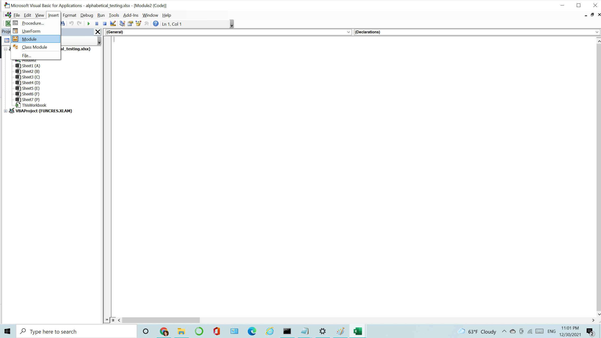

# The-VBA-of-Wall-Street
## Background

### Stock market analyst

## Instructions

1.  Download the .bas file and the alphabetical_testing.xlsx 
1. Open the excel file
2. Hold down the ALT + F11 keys to open the Microsoft Visual Basic for Applications window.
3. Click Insert > Module

4.Copy the .bas file and paste it in the Module Window and click the green arrow and run!

## After running

* The script will loop through all the stocks for one year and output will be  the following information.

  * The ticker symbol.

  * Yearly change from opening price at the beginning of a given year to the closing price at the end of that year.

  * The percent change from opening price at the beginning of a given year to the closing price at the end of that year.

  * The total stock volume of the stock.

* There is a conditional formatting that will highlight positive change in green and negative change in red.

* The result should look as follows.

### More

1. The VBA script will also be able to return the stock with the "Greatest % increase", "Greatest % decrease" and "Greatest total volume". The solution will look as follows:

2. The VBA script that will allow it to run on every worksheet, i.e., every year, just by running the VBA script once.

### Other Considerations

* The sheet `alphabetical_testing.xlsx`  data set is small and will allow you to test faster. The code should run on this file in less than 3-5 minutes.

### Copyright

© 2021 Trilogy Education Services, LLC, a 2U, Inc. brand. Confidential and Proprietary. All Rights Reserved.
